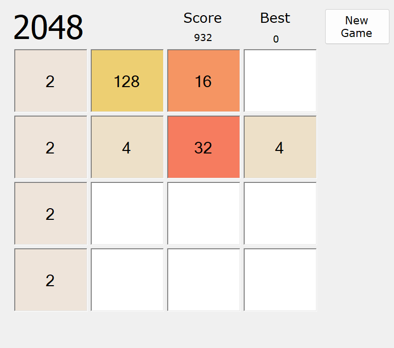

# 2048 Game

## 📜 Popis projektu

Tento projekt je implementací populární hry **2048** v jazyce **C#**. 
Cílem hry je skládat destičky s násobky čísla 2 a dosáhnout tak čísla **2048**

## ⚙️ Funkce

- Pohyb destiček pomocí WASD na klávesnici.
- Automatické sloučení destiček při jejich styku.
- Výpočet skóre na základě hodnot sloučených dlaždic.
- Možnost restartu hry s uložením nejvyššího score.

## 🧠 Použité techniky

- Rekurze
- User control
- Dynamické přidávání komponet do Formu
  
## 🎮 Ovládání
- Tlačítko **New Game** resetuje hru a vygeneruje 2 náhodné destičky
- **Score** se počítá ze sečtených destiček: 2 + 2 -> 4.. Score = 4
- S **Destičkami** se pohybuje pomocí W/A/S/D
    - W : Nahoru
    - A : Doleva
    - S : Dolu
    - D : Doprava 
- Hra končí pokud se hráči povede poskládat destičku s číslem 2048 (vyhrál) nebo zaplněním všech polí -> nemůže se objevit nová destička (prohrál)

## 📂 Struktura projektu

- **2048.sln**: Hlavní řešení projektu.
- **Program.cs**: Hlavní vstupní bod aplikace.
- **Form1.cs**: Logika i grafické rozhraní pomocí Windows Forms.
- **Cell.cs**: Třída typu User control pro jednotlivou destičku
- **GameOver.cs** Třída typu Windows Forms. Okno konce hry.

## 🔧 Požadavky

- .NET Framework 4.7.2 nebo vyšší
- Visual Studio 2019 nebo novější

## 🛠️ Instalace
### .exe souboru
- V této složce soubor 2048.exe
- Kliknout na něj
- Vpravo nahoře tlačítko "Download raw file"
### Celé řešení
- Vrátit se zpět na [repozitář SPSUL](../)

## 📸 Ukázka hry

