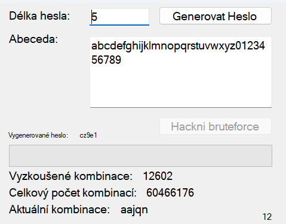

# BruteForce

## 📜 Popis projektu

Tento projekt je jednoduchým nástrojem na **brute-force** útoky pro prolomení hesel v jazyce **C#**. **Brute-force** metoda zkouší všechny možné kombinace znaků, dokud nenajde správné heslo. Pouze určen pro výukové účely.

> **⚠️ Upozornění: Tento nástroj je určen pouze pro legální a etické účely, jako výuka programování. Nepoužívejte jej k nelegálním aktivitám.**

## ⚙️ Funkce

- Možnost zvolit délku hesla a sadu znaků.
- Podporuje různé typy znaků: malá písmena, velká písmena, číslice a speciální znaky.
- Vizualizace postupu při hledání hesla.
- Výpočet času potřebného k prolomení hesla.

### 🧠 Použité techniky

- Rekurze
- Vlákna
- Akce (Action)

## 🎮 Ovládání
- Textová pole "Délka hesla" a "Abeceda" lze přepsat
- Tlačítko "Generovat Heslo" vygeneruje náhodné heslo ze tvolené délky a abecedy znaků
    - znovukliknutí na tlačítko vyresetuje aplikaci
- Tlačítko "Hackni bruteforce" započne prolomování hesla
- Texty dole se naplní informacemi po zvolení hesla a kliknutí na "Hackni bruteforce" tlačítko

## 📂 Struktura projektu

- **WindowsFormsApp1.sln**: Hlavní řešení projektu.
- **Program.cs**: Hlavní vstupní bod aplikace.
- **Form1.cs**: Implementace logiky brute-force útoku a grafické rozhraní aplikace pomocí Windows Forms.

## 🔧 Požadavky

- .NET Framework 4.7.2 nebo vyšší
- Visual Studio 2019 nebo novější

## 🛠️ Instalace
### .exe souboru
- V této složce soubor BruteForce.exe
- Kliknout na něj
- Vpravo nahoře tlačítko "Download raw file"
### Celé řešení
- Vrátit se zpět na [repozitář SPSUL](../MrVendys/SPSUL)

## 📸 Ukázka

