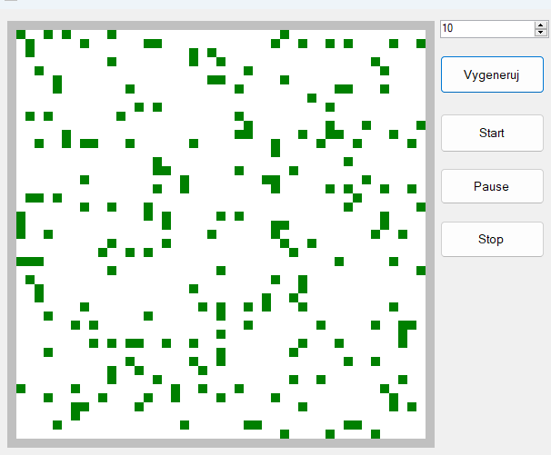

# Game of Life

## 📜 Popis projektu

Tento projekt je implementací **Conwayovy hry života** (Game of Life) v jazyce **C#**. Hra života je celulární automat, kde se buněčné struktury vyvíjejí podle jednoduchých pravidel.

## ⚙️ Funkce

- Inicializace náhodné nebo uživatelem definované konfigurace buněk.
- Simulace životního cyklu buněk podle pravidel hry života.
- Zobrazení grafického výstupu v okně.
- Možnost Pozastavení a Restartování
  
## 🧠 Použité techniky

- Vykreslovani (e.Graphics)
- Timer

## 🎮 Ovládání
- **Číselny vstup**: slouží pro výpočet počtu vygenerovaných buněk
- tlačítko **Vygeneruj** vygeneruje buňky podle zvoleného počtu
- tlačítko **Start** spustí Game Of Life podle jejich pravidel
  - Pravidla:
    - Pokud živá buňka má 1 nebo méně živých sousedních buněk.... umírá
    - Pokud živá buňka má 2-3 sousedy.... přežívá
    - Pokud živá buňka má více než 3 sousedy.... umírá
    - Pokud mrtvá buňka má přesně 3 sousedy.... ožívá
- Tlačítko **Pause** pozastaví koloběh buněk
- Tlačítko **Stop** vyresetuje panel a všechny buňky nastaví na neživé

## 📂 Struktura projektu

- **Prace.sln**: Hlavní řešení projektu.
- **Program.cs**: Hlavní vstupní bod aplikace.
- **Form1.cs**: Logika simulace životního cyklu buněk a grafické rozhraní hry pomocí Windows Forms.
- **Bunka.cs**: Třída pro jednotlivou buňku, slouží i pro její vykreslování.

## 🔧 Požadavky

- .NET Framework 4.7.2 nebo vyšší
- Visual Studio 2019 nebo novější

## 🛠️ Instalace
### .exe souboru
- V této složce soubor GameOfLife.exe
- Kliknout na něj
- Vpravo nahoře tlačítko "Download raw file"
### Celé řešení
- Vrátit se zpět na [repozitář SPSUL](../)

## 📸 Ukázka simulace

