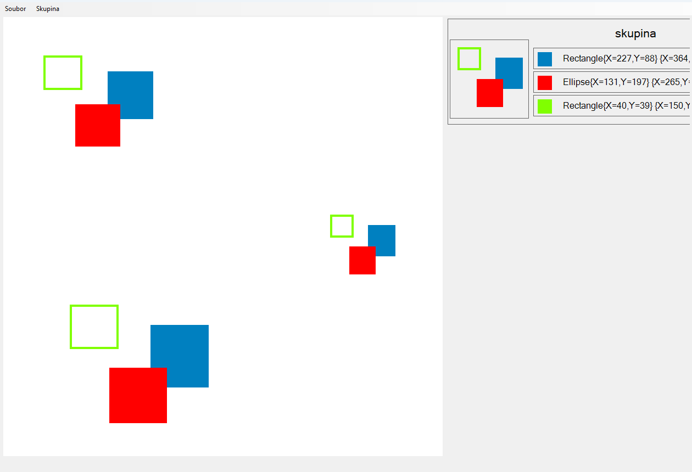

# Příkazové vykreslování

## 📜 Popis projektu

Tento projekt slouží pro vykreslování různých tvarů na canvas zapomocí vykreslování v **C#**, **Windows Forms**.

## ⚙️ Funkce

- Nakreslení "prázných" nebo vyplněných tvarů.
- Volení barev.
- Ukládání do skupin tvarů, které se následně mohou vykreslit. (Funguje pouze pro Rectangle a Ellipse)
- Ukládání a načítání skupin v .json podobě.

## 🧠 Použité techniky

- Windows Forms
- User control
- Polymorfismus
- Vykreslovani (e.Graphics)

## 🎮 Ovládání
- Aplikace se skládá postupně ze 3 oken:
- **Form1**: Hlavní okno, slouží pro vykreslování skupin na plátno, jejich načítání a ukládání
  - Horní panel má 2 tlačítka: **Soubor** a **Skupina**
    - **Soubor**: Ukládá a Načítá skupiny obrazců v .json podobě
    - **Skupina**: Začne s tvořením nové skupiny obrazců
- **GroupManager**: Druhé okno pro vykreslování jednotlivých obrazců a jejich udržování ve skupině
  - Nahoře vpravo se může skupina pojmenovat, vlevo nahoře je soupis obrazců
  - Lze kliknout pravým pro přesun nahoru, dolu či smazání (Nebo použít Drag & Drop)
  - Vlevo se vykreslují všechny obrazce na plátně. Vpravo tlačítko **+** pro vytvoření nového obrazce a **OK** pro uložení skupiny
- **CommandForm**: Třetí okno slouží pro kreslení jednotlivých obrazců do jedné skupiny
  - Vlevo se kreslí a zároveň vykreslují siluety již nakreslených obrazců
  - Vpravo se vybírá typ obrazce, jeho **Barva** a jestli bude **Vyplněn**
  - Následně tlačítko **OK** uloží nakreslený obrazec

  
## 📂 Struktura projektu

- **PrikazoveVykreslovani.sln**: Hlavní řešení projektu.
- **Program.cs**: Hlavní vstupní bod aplikace.
- **Form1.cs**: Uživatelské rozhraní a ukládání/načítání skupin.
- **Groupe.cs**: Třída pro práci se skupinou obrazců.
- **GroupeManager.cs**: Grafické rozhraní pro vytváření skládání skupin obrazců.
- **CommandForm.cs**: Grafické rozhraní pro kreslení obrazců.
- **Shapes.cs**: Třída pro dědění vlastností pro jednotlivé třídy obrazců.

## 🔧 Požadavky

- .NET Framework 4.7.2 nebo vyšší
- Visual Studio 2019 nebo novější

## 🛠️ Instalace
### .exe souboru
- V této složce soubor PrikazoveVykreslovani.exe
- Kliknout na něj
- Vpravo nahoře tlačítko "Download raw file"
### Celé řešení
- Vrátit se zpět na [repozitář SPSUL](../)

## 📸 Ukázka aplikace

