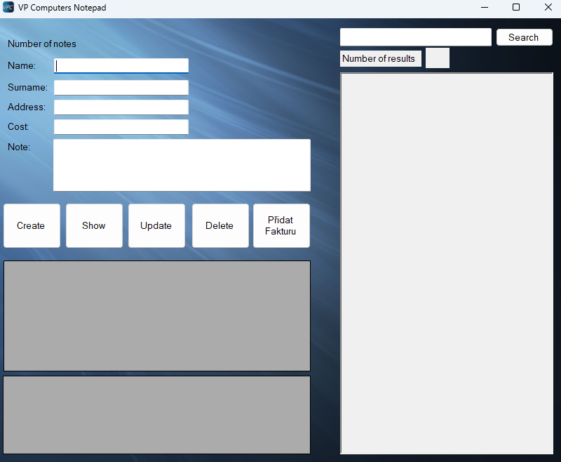

# Půlročníkovka (Záznamník)

## 📜 Popis projektu

Projekt v rámci předmětu na střední škole. Za úkol bylo za půl roku vytvořit projekt s následujícími požadavky:
Projekt musí využívat databáze (**MySQL** pomocí XAMPP)
Projekt musí být zrealizován v **C# .NET** nebo **HTML + PHP**

V tomto projektu jsem využil **C# .NET**

> **⚠️ Upozornění: Tento projekt není ve spustitelném tvaru. Je plně závislý na souběžném chodu s databází.**

## 🎮 Funkce

- Vytvoření, ukázání, upravení, smazání záznamu.
- Vyhledávání jednotlivého záznamu.
- Vypočítání všechn záznamů dle hledaného výrazu.

## 🔧 Požadavky

- .NET Framework 4.7.2 nebo vyšší
- Visual Studio 2019 nebo novější

## 📂 Struktura projektu

- **Projekt.sln**: Hlavní řešení projektu.
- **Program.cs**: Hlavní vstupní bod aplikace.
- **Form1.cs**: Grafické rozhraní a logika pro práci s databází.
- **Edit.cs**: UserControl pro upravování záznamu.

## 📸 Ukázka aplikace

