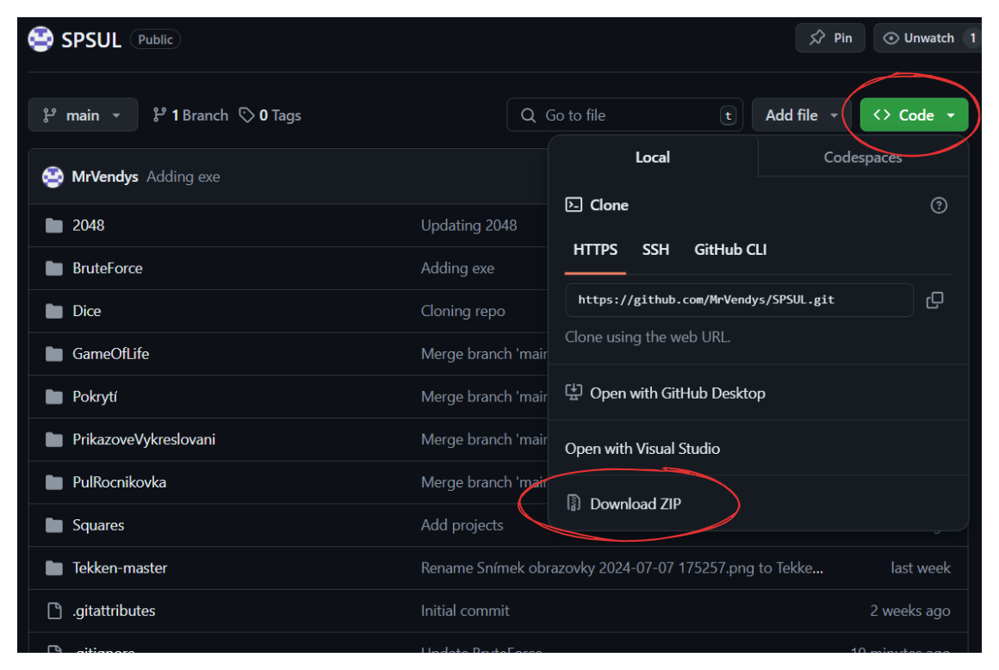

# Projekty ze Střední Školy

## 📚 Úvod

Tento repozitář obsahuje několik programovacích projektů, které jsme vytvořili v rámci vyučovacích hodin na střední škole. Tyto projekty slouží jako ukázky našich dovedností v programování a ukazují různé techniky a postupy, které jsme se naučili.

## 🖥️ Seznam projektů
Všechny v jazyce **C#**

1. **2048 Game**
   - [Přejít na projekt](./2048)

2. **BruteForce Password Cracker**
   - [Přejít na projekt](./bruteforce-password-cracker)

3. **Game of Life**
   - [Přejít na projekt](./GameOfLife)

4. **Pokrytí**
   - [Přejít na projekt](./Pokrytí)

5. **Příkazové Vykreslování**
   - [Přejít na projekt](./PrikazoveVykreslovani)

6. **Půl Ročníkovka**
   - [Přejít na projekt](./PulRocnikovka)

7. **Tekken-master**
   - [Přejít na projekt](./Tekken-master)

8. **Ročníkovka**
   - [Přejít na projekt](./Dice)

## 🎯 Cíle projektů

- Naučit se základy programování v jazyce C#.
- Práce s grafickými rozhraními v Windows Forms.
- Zlepšení dovedností v řešení problémů a algoritmickém myšlení.
- Získání zkušeností s vývojem a laděním softwaru.

## 🛠️ Stáhnutí projektu
- Jednotlivé projekty mají své .exe soubory. Stačí stánout jen to.
- Pro stažení celého řešení (pro kód), zelené tlačítko "Code" -> "Download ZIP"
  
