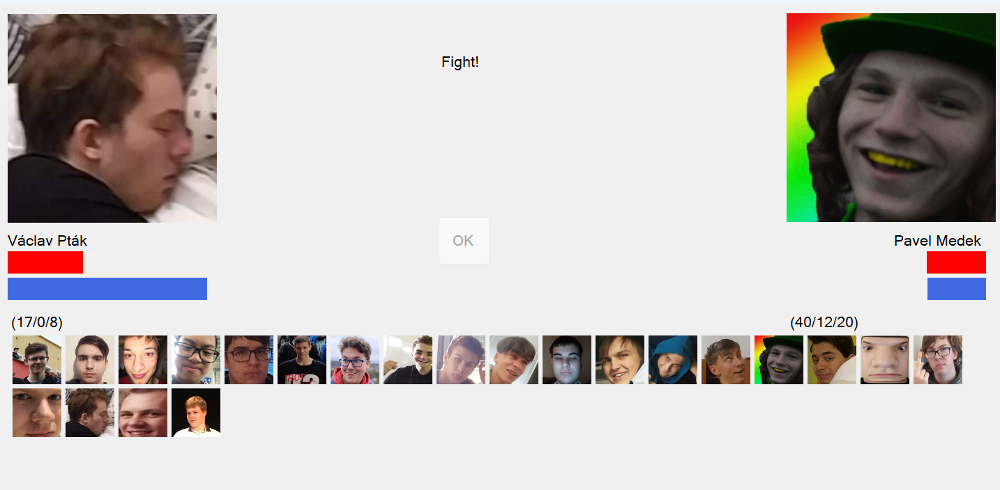

# Tekken-master

## 📜 Popis projektu

Tento projekt je imitací 2D hry Tekken v jazyce **C#**. Hráč si vybere charakter, za který bude bojovat a za pomocí miniher sbírá score, které poté promění na poškození do protihráče.

> **⚠️ Upozornění: Tento projekt obsahuje legrační fotky žáků naší třídy. Vše je schválené.**

## 🎮 Funkce

- Uřivatel si může zvolit charakter, za kterého bude bojovat.
- Náhodné zvolení protivníka.
- Několik miniher, které se náhodně volí a postupem se stěžují.
- Obrazovka vítěze.

## 🔧 Požadavky

- .NET Framework 4.7.2 nebo vyšší
- Visual Studio 2019 nebo novější

## 📂 Struktura projektu

- **Tekken.sln**: Hlavní řešení projektu.
- **Program.cs**: Hlavní vstupní bod aplikace.
- **Game.cs**: Hlavní grafické rozhraní.
- **WaveMatch.cs**,**Targets.cs**,**MathCalc.cs**,**Letters.cs**,**Pong.cs**: Minihry
- **Fighters.cs**: Seznam bojovníků.
- **Fighter.cs**: Třída pro jednotlivého bojovníka

## 📸 Ukázka aplikace

